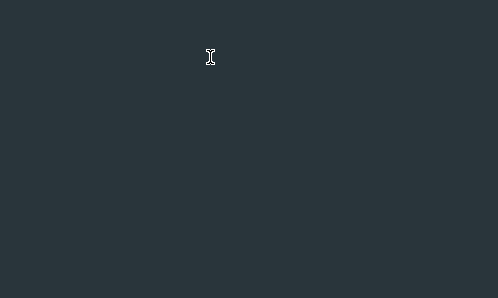

# baan

Keyboard input expansion for Linux. Type a tag (or copy `name:?arg` and Ctrl+C), run a command, inject the output.

```text
<hi>                 →  Hello World!
<hello>Ada</hello>   →  Hello Ada!
base64:?secret + Ctrl+C  →  result on clipboard (paste with Ctrl+V)
```



Needs root (or equivalent) for `/dev/input` and `/dev/uinput`. Works on Wayland and X11.

## Prerequisites

- Linux with `/dev/input` and `/dev/uinput`
- [Rust toolchain](https://rustup.rs/) (to build) and `sudo`
- A keyboard with **no** arrow/navigation keys already remapped (see `devices` helper if you need plain typing only)

## Install with the setup script

The [`setup.sh`](setup.sh) script handles the whole install: it builds the release
binary, installs it plus the systemd template unit and a system-wide config, then
starts the daemon for your keyboard.

```bash
git clone https://github.com/robatipoor/baan.git
cd baan
./setup.sh --install          # builds, installs, enables + starts the service
```

Run as a normal user — `sudo` is prompted only for the privileged steps.

The script auto-detects a keyboard device with a kbd handler, or take one explicitly:

```bash
./setup.sh --install -k event3                 # named device: /dev/input/event3
./setup.sh --install -c ./baan.example.toml    # install your own config
./setup.sh --install --no-start                # install only, don't start yet
./setup.sh --install --prefix /opt             # alternate prefix
```

| Setup option | Description |
|--------------|-------------|
| `-k, --keyboard eventN` | Keyboard device node (auto-detected if omitted) |
| `-c, --config PATH` | Source config → `/etc/baan/baan.toml` (default `baan.example.toml`) |
| `--prefix PATH` | Install prefix for the binary (default `/usr/local`) |
| `--no-start` | Install but don't enable/start the service |
| `--uninstall` | Stop/disable the service and remove installed files |

To uninstall, run `./setup.sh --uninstall` from the same directory.

### What it installs

- Binary: `/usr/local/bin/baan`
- Service: `/etc/systemd/system/baan@.service` (started as `baan@<eventN>.service`)
- Config: `/etc/baan/baan.toml`

Check it's running:

```bash
systemctl status baan@event3.service
journalctl -u baan@event3.service -f
```

### Manual / alternative install

```bash
cargo build --release
sudo cp target/release/baan /usr/local/bin/
mkdir -p ~/.config/baan && cp baan.example.toml ~/.config/baan/baan.toml
./devices        # pick a keyboard: /dev/input/eventN
```

## Usage

```bash
sudo -E baan -k /dev/input/event3
./run.sh -d -k /dev/input/event3            # build + run (debug)
./run.sh -r -k /dev/input/event3 -c ./baan.example.toml
```

| Flag | Env | Default |
|------|-----|---------|
| `-k`, `--keyboard-path` | `BAAN_KEYBOARD_PATH` | required |
| `-c`, `--config-path` | `BAAN_CONFIG_FILE_PATH` | `$XDG_CONFIG_HOME/baan/baan.toml` (fallback `~/.config/baan/baan.toml`) |

As root, the default config is often `/root/.config/baan/baan.toml` — use `-c` for your user file. `sudo -E` / `./run` keep session env for clipboard (see [Clipboard](#clipboard)).

## Configuration

See [`baan.example.toml`](baan.example.toml). Triggers live in a `[triggers]` table; each key's value is a string array. `#` comments and multi-line arrays are allowed.

```toml
[triggers]
hi     = ["echo", "-n", "Hello World!"]
hello  = ["echo", "Hello {}!"]
base64 = ["sh", "-c", "echo -n {} | base64"]
```

Runtime settings live in a `[baan]` table (all optional):

```toml
[baan]
flush_delay_ms = 100             # delay before injecting output
clipboard_read_delay_ms = 120    # delay before reading clipboard after Ctrl+C
clipboard_write_delay_ms = 80    # delay before pasting after writing clipboard, and before restoring old value
```

For backward compatibility, triggers at the top level of the file (outside any table) are still accepted.

| Invoke | Example | Result |
|--------|---------|--------|
| Type tag | `<hi>` / `<hello>Ada</hello>` | Backspace tag, inject stdout into focused app |
| Clipboard | copy `base64:?secret`, **Ctrl+C** | Stdout replaces clipboard; you **Ctrl+V** to paste |

`{}` is the tag body or the text after `:?`. Trigger names must be unique.

ASCII output is typed via uinput. Non-ASCII output is written to the clipboard with `arboard` and pasted with synthetic Ctrl+V.

## systemd

When installed via `setup.sh`, the unit is already in place and enabled. To set it up manually:

```bash
sudo cp baan@.service /etc/systemd/system/
sudo mkdir -p /etc/baan
sudo cp ./baan.example.toml /etc/baan/baan.toml
sudo systemctl daemon-reload
sudo systemctl enable --now baan@event3.service   # → /dev/input/event3
```

```bash
sudo systemctl status baan@event3.service
journalctl -u baan@event3.service -f
```

The unit uses `BAAN_CONFIG_FILE_PATH=/etc/baan/baan.toml`. It waits for a Wayland/X11 socket to appear before starting, and the clipboard auto-discovers the live session after graphical login. If it started before you logged in, restart it once:

```bash
sudo systemctl restart baan@event3.service
```

## Clipboard

baan needs a graphical session for clipboard operations. On build it auto-discovers a live Wayland/X11 session and sets `DISPLAY`, `WAYLAND_DISPLAY`, and `XAUTHORITY` accordingly. Make sure `sudo -E` (or `./run`) preserves your session environment, and that baan runs in the same session you're typing in.

## Development

```bash
cargo test                     # run the unit test suite
./run.sh -d -c ./baan.example.toml   # build + run locally (debug)
```

## License

[MIT](LICENSE)